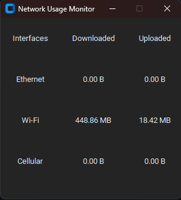

# Network Usage Monitor app

- retriving network data using C++
- UI using Python
  



# Use the app
- python libs you will need:
```bash
 pip install customtkinter pybind11
```
- get and start the code:
```git
 git clone https://github.com/aaa2005/network-usage-monitor-win.git 
 cd network-usage-monitor-win
 ./start.bat
```

# To rebuild the app

- clone the repo along with pybind11 for C++:
```bash
 git clone https://github.com/aaa2005/network-usage-monitor-win.git 
 cd network-usage-monitor-win
 git clone https://github.com/pybind/pybind11.git extern/pybind11
```
- build the netusage module (using MinGW):
```bash
 mkdir build
 cd build
 cmake -G "MinGW Makefiles" ..
 mingw32-make
```
